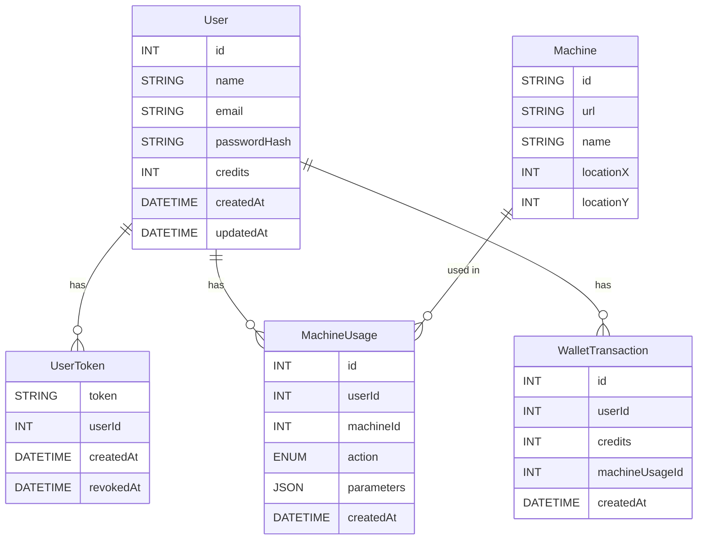

# Module C – Sudsy Laundry Backend

## Overview

Sudsy's development division is working on a revolutionary laundromat facility that leverages artificial intelligence and IoT solutions. The team operates in a test laboratory where they are developing the prototype of the new self-service laundromat. They have installed high-performance washing and drying machines representing cutting-edge technology. These machines can communicate over the network through standard interfaces, continuously provide status and telemetry data, and receive external control commands. **These communication tasks are handled by basic web servers integrated into the machines**.

The development team's task is to create a backend and frontend component system that, working together with the machines, can provide a service that meets the highest user requirements.

In this module, as a member of the development team, your task is to **create a simplified prototype of the backend application that communicates with the washing machines and the frontend application used by users**.

You don't need to implement the basic web servers integrated into the washing machines, they are already available to you. In the test environment, four web servers (`M001`, `M002`, `M003`, `M004`) are running, which can be accessed at
https://module-c-YYYY-wm-X.sudsy.com URL, where X is the machine number (1-4)
and YYYY is your PIN code.

The embedded servers in the machines expose:

- **Machine info** – static metadata and full program catalogue
- **Live status** – `idle │ operational │ paused`, remaining time, etc.
- **Control endpoints** – start, pause, resume, stop

Your job in this module is to write a **central backend** that:

1. **Speaks** to every machine inside the LAN.
2. **Exposes** a secure, documented REST API to the public web front‑end.
3. **Persists** all users, credits, and usage history in MySQL.
4. Enforces all **business rules** (credit checks, payment at start, etc.).

The rest of this document details the functional scope, required endpoints, data model and evaluation rubric.

---

## 1 General information

### 1.1 Use‑case summary

The backend supports a **typical customer journey** inside a fully automated laundromat:

1. **Registration / Login** – users create an account or sign in on the kiosk / mobile PWA.
2. **Credit top‑up** – users purchase virtual credits (1 credit = €0.50) via card or cash‑acceptor.
3. **Machine discovery** – the UI fetches a live list of machines with their details and current state (`idle`, `operational`, `paused`) and, if busy, the _expected free‑at_ time.
4. **Program start** – when a machine is idle, the user can:
   - choose a program and parameters
   - the backend verifies sufficient credits (`10 credits / hour + 5 credits` detergent)
   - sends `/control/start` to the machine with the chosen parameters
   - deducts the calculated amount from the user's wallet
5. **In‑cycle actions** – pause / resume / stop are proxied to `/control/pause` etc.; state changes can be polled via `/status`

### 1.2 Authentication

Authentication is **token‑based**:

1. Users authenticate with **username + password** via `POST /users/login`.
2. On success the backend generates a **64‑character hexadecimal Bearer token** using a cryptographically secure RNG (Node → `crypto.randomBytes(32).toString('hex')`, Laravel → `Str::random(64)`).
3. The token is stored in table **`UserToken`** together with `userId`, `createdAt` and `revokedAt` (nullable).
4. Clients must include the token in every protected request:
   ```http
   Authorization: Bearer 1f3c…a985
   ```
5. A user may have **multiple active tokens** (multi‑device login). Logout simply sets `revokedAt`.

Unauthenticated or revoked tokens must yield **401 Unauthorised**.

### 1.3 Database

## You must provide a complete database dump at the end of the module for evaluation purposes. You should include the dump in your solution's repository.

## 2 Embedded Web Server in the Washing Machine

### 2.1 Protocol & Security

- **Security:** No authentication required
- **Base URL:** Each machine has its own URL in the local network. The machine URLs follow this pattern: `https://module-c-YYYY-wm-X.sudsy.com`, where `X` is the number of the washing machine and `YYYY` is your PIN_code
- **Response Format:** All responses are in JSON with UTF-8 encoding

### 2.2 Base information about the washing machine

- `id`, `name`, `type`, `model`, `availablePrograms`: via `/machineInfo`

### 2.3 State Management

Washing machines manage their status as follows:

- Information on the current status: via `/state`
- Machine states: `idle`, `operational`, `paused`
- State transitions:
  - `idle` → `operational`: via `/control/start`
  - `operational` → `paused`: via `/control/pause`
  - `paused` → `operational`: via `/control/resume`
  - `operational/paused` → `idle`: via `/control/stop`

### 2.4 Available Endpoints

For a detailed description of all the endpoints of the web server integrated in washing machines, see [Appendix A](assets/module-c/module-c-appendix-a.md).
You can also find an [Open API documentation](assets/module-c/washing-machine-web-service-openapi.yaml) in the `assets/module-c` folder, which you can import into HoppSchotch.

## 3 Data Model

- The backend uses a **MySQL** database for data storage.
- It can be accessed at `db.sudsy.com`, using port `3306` with the provided credentials.
- The database name follows the format: `competitor-Y`, where `Y` is your workstation number.

The database is currently empty. Use the given SQL dump in [`assets/module-c/db.sql`]('./assets/module-c/db.sql) to import the data.
PHPMyAdmin is also available at `pma.sudsy.com`.

Do not change the structure of the database.



## Endpoints to be implemented on the backend

### General rules for the API

- Port: 80
- The response bodies contain some static example data. Dynamic data from the database should be used.
- Placeholder parameters in the URL are marked with a preceding colon _(e.g :slug)_
- The order of properties in objects does not matter, but the order in an array does.
- The `Content-Type` header of a response is always `application/json` unless specified otherwise.
- The given URLs are relative to the base URL of the API: `/api/v1`.
- All endpoints require Bearer token authentication except for the following:

  - POST `/users/register`
  - POST `/users/login`
  - GET `/machines`

- The token for protected endpoints must be specified as a Bearer token in the `Authorization` header: `Authorization: Bearer <token>`
- In case of a missing or invalid token, the backend should return a `401 Unauthorized` response:

**Response:** 401 Unauthorized

```json
{
  "message": "Invalid or expired token"
}
```

- Pay attention to the defined HTTP status codes. The backend should return the correct status code for each endpoint.
- Implement the error handling as described in the API documentation. The backend should return the correct error message and status code for each endpoint.

You can find an [Open API documentation](assets/module-c/central-backend-openapi.yaml) in the `assets/module-c` folder, which you can import into HoppSchotch.

### User Management API

#### POST /users/register

Register a new user. New users have 0 credits by default. An email address must be unique.

**Request Body:**

```json
{
  "email": "user@example.com",
  "password": "password123",
  "name": "John Doe"
}
```

**Response (on success):** 201 Created

```json
{
  "message": "User created successfully",
  "user": {
    "id": 1,
    "email": "user@example.com",
    "name": "John Doe",
    "credits": 0
  }
}
```

**Response (if email is already taken):** 400 Bad Request

```json
{
  "message": "Failed to register user"
}
```

---

#### POST /users/login

Login with email and password.

**Request Body:**

```json
{
  "email": "user@example.com",
  "password": "password123"
}
```

**Response (on success):** 200 OK

```json
{
  "message": "Login successful",
  "user": {
    "id": 3,
    "name": "Zolee Helmet",
    "email": "zolee@itmp.hu",
    "credits": 170
  },
  "token": "fe86c16e11e285e5eadab944f5a54536fc2299667b704d247595c2c76a8fa466"
}
```

**Response (on failure):** 401 Unauthorized

```json
{
  "message": "Invalid email or password"
}
```

---

#### POST /users/logout

Logout the current user. Sets the `revokedAt` field of the user's token to the current time. **If the token is invalid or already revoked, it should return the generic 401 Unauthorized error defined above.**

**Response (on success):** 200 OK

```json
{
  "message": "Logout successful"
}
```

---

#### GET /users/me

Get the current user's information, including their available credit balance.

**Response:** 200 OK

```json
{
  "id": 1,
  "email": "user@example.com",
  "name": "John Doe",
  "credits": 100
}
```

---

#### POST /users/me/credits

Add a specified amount of credits to the user's account balance. Additionally, log the transaction in the WalletTransaction table by the amount of topup as a positive value. Returns the new credit balance of the user in the `credits` field. **The amount cannot be negative or zero.**

**Request Body:**

```json
{
  "amount": 100
}
```

**Response (on success):** 200 OK

```json
{
  "message": "Credits added successfully",
  "credits": 110
}
```

**Response (on invalid amount):** 400 Bad Request

```json
{
  "message": "Invalid amount"
}
```

---

### Machine API

#### GET /machines

Get the details of all machines stored in the database. The machines' details should be fetched from the machines' web servers. The backend should aggregate the data and return it in a unified format.

**Response:** 200 OK

```json
[
  {
    "id": "M001",
    "name": "Sudsy WM-0001",
    "type": "Washing Machine",
    "brand": "Samsung",
    "model": "WF10000",
    "locationX": 31,
    "locationY": 31
  }
]
```

#### GET /machines/:id

Get a machine's details by ID. The details of the machine should be fetched from the machine's web server.

The `myCycle` field in the response indicates whether the machine was started by the authenticated user.
The logic is as follows:

1. If the machine status is not `operational` or `paused`, then `myCycle` is `false`.
2. If the machine status is `operational` or `paused`, then the question is determined based on the most recent record with `start` value in the `action` of `MachineUsage` table for that machine:

   - If no such record exists, `myCycle` is `false`.
   - If such a record exists, `myCycle` is `true` if the record belongs to the given user, `false` otherwise.

**Response:**

```json
{
  "id": "M001",
  "name": "Sudsy WM-0001",
  "type": "Washing Machine",
  "brand": "Samsung",
  "model": "WF10000",
  "availablePrograms": [
    {
      "name": "Normal",
      "spinSpeed": [800, 1200, 1600],
      "temperature": [30, 40, 50],
      "duration": 3600
    }
  ],
  "locationX": 31,
  "locationY": 31,
  "status": {
    "operationalStatus": "operational",
    "currentProgram": {
      "name": "Normal",
      "temperature": 40,
      "spinSpeed": 1200,
      "duration": 3600,
      "startTime": "2025-04-27T19:23:27.819Z",
      "remainingTime": 3254
    }
  },
  "myCycle": "true"
}
```

#### POST /machines/:id/start

Launch a program on an `idle` state machine, if the user has enough credits for the selected program. The request must include the program name and the parameters.

The program name must be one of the available programs for the machine. The parameters (`spinSpeed` and `temperature`) must match one of the available values for the selected program. The backend should validate the program and its parameters and return an error if they are invalid.

The backend calculates the credit cost as follows:

```
cost = ceil(duration[s] / 3600) × 10 + 5
```

The duration is determined by the selected program. The duration is not affected by the parameters.

_**Example**: 42‑minute wash (2520 seconds) ⇒ ceil(2520 / 3600) × 10 + 5 = 1 × 10 + 5 = 15 credits._

If the program can start:

- Send the `/control/start` command to the machine with the selected program and parameters.
- Create a log entry in the `MachineUsage` table, where the action field is set to `start`. Set `userId` to the authenticated user's ID, `machineId` to the machine's ID, and `parameters` to the program parameters in JSON format.
- Deduct the program's credit cost from the user's credit balance
- Log the transaction in the `WalletTransaction` table, referencing the created `MachineUsage` `id`. Set `credits` by the program's credit cost as a **negative value**.

**Request Body:**

```json
{
  "name": "Normal",
  "parameters": {
    "spinSpeed": 1200,
    "temperature": 40
  }
}
```

**Response (on success):** 200 OK

```json
{
  "message": "Machine started successfully",
  "machineId": "M002",
  "programName": "Normal",
  "parameters": {
    "spinSpeed": 1200,
    "temperature": 40,
    "duration": 3600
  },
  "creditsDeducted": 15,
  "remainingCredits": 170
}
```

**Response (if machine is not in idle):** 400 Bad Request

```json
{
  "message": "Operation not allowed in current state"
}
```

**Response (if invalid program name or parameters):** 400 Bad Request

```json
{
  "message": "Invalid program parameters"
}
```

**Response (if insufficient credits):** 409 Conflict

```json
{
  "message": "Insufficient credits"
}
```

---

#### PATCH /machines/:id/stop

Stopping the program on an operational or paused status machine. The program can only be stopped by the user who started it. If the user stops the program before it finishes, they will not receive a credit refund.

Sends the `/control/stop` command to the machine.

If the program stops successfully, create a log entry in the `MachineUsage` table, where the `action` field is set to `stop`, `parameters` field is set to empty JSON object.

**Response (on success):** 200 OK

```json
{
  "message": "Machine stopped successfully"
}
```

**Response (if machine is not in operational or paused):** 400 Bad Request

```json
{
  "message": "Operation not allowed in current state"
}
```

**Response (if not the authetnicated user started the program):** 403 Forbidden

```json
{
  "message": "You are not authorized to stop this machine"
}
```

---

#### PATCH /machines/:id/pause

Suspend the program on an `operational` status machine. The program can only be stopped by the user who started it. The paused state has no additional cost for the user.

Sends the `/control/pause` command to the machine.

If the program pauses successfully, create a log entry in the `MachineUsage` table, where the `action` field is set to `pause`.

**Response (on success):** 200 OK

```json
{
  "message": "Machine paused successfully"
}
```

**Response (if machine is not in operational):** 400 Bad Request

```json
{
  "message": "Operation not allowed in current state"
}
```

**\*Response (if the authetnicated user did not start the program):** 403 Forbidden

```json
{
  "message": "You are not authorized to pause this machine"
}
```

---

#### PATCH /machines/:id/resume

On a machine with `paused` status, the program is resumed. The program can only be resumed by the user who started it.

Sends the `/control/resume` command to the machine.

If the program resumes successfully, create a log entry in the `MachineUsage` table, where the `action` field is set to `resume`.

**Response (on success):** 200 OK

```json
{
  "message": "Machine resumed successfully"
}
```

**Response (if machine is not in paused):** 400 Bad Request

```json
{
  "message": "Operation not allowed in current state"
}
```

**Response (if the authetnicated user did not start the program):** 403 Forbidden

```json
{
  "message": "You are not authorized to resume this machine"
}
```

---
